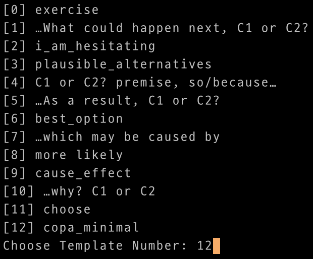

# Exploiting the Potential of Seq2Seq Models as Robust Few-Shot Learners
This is an experimental baseline for the paper "Exploiting the Potential of Seq2Seq Models as Robust Few-Shot Learners"

# How to Use?
### Installation
```bash
pip install torch==1.13.1+cu117 --extra-index-url https://download.pytorch.org/whl/cu117
pip install -e .
```

### Running Commad
```bash
# super_glue/boolq few-shot example command
# add --num_gpus {NUM_GPUS} arg for model parallel w/ identical "python" command
python k_shot.py --model_path google/t5-v1_1-xxl --seed 2022 --type k-shot --num_k 5 --dataset_name super_glue --subtask_name copa --use_sentinel
# choose proper template from the list to inference
```
### Choose Proper Template


### Running Multiple Evaluations at Once
See the files below:
- `run_many_eval.py` : python running script for evaluation with prompts from promptsource
- `run_minimal_template.py` : python running script for evaluation with prompts from lm-evaluation-harness  
```bash
python run_many_eval.py --model_path google/t5-v1_1-xxl --seed 2022 2023 --type fid-k-shot --num_k 5 --dataset_name super_glue --subtask_name rte --train_path None --valid_path None --use_sentinel --run_all_tmeplates
```
See also `scripts` directory for more example scripts.

# Note for Terms Used in the Paper
We compare three different methods in the paper: `original` `early-fusion` `late-fusion`  
These terms correspond to the arguments for `--type` as following: 
- `original`: `k-shot`
- `early-fusion`: `fid-k-shot`
- `late-fusion`: `rag-token-k-shot`

## Baseline models used in the paper
- `T5`: `google/t5-v1_1-xxl`
- `T5-LM`: `google/t5-xxl-lm-adapt`
- `UL2`: `google/ul2`
- `T0`: `bigscience/T0`


# Support Tasks
- super_glue : boolq, copa, cb, rte, wic, wsc.fixed, record, boolq, multirc
- anli1, anli2, anli3
- hellaswag
- story_cloze : 2016
- winogrande : winogrande_xl
- xsum
- enriched_web_nlg: en  


# Template Source
All the template sources are from the link below
- Promptsource demo: https://huggingface.co/spaces/bigscience/promptsource
- See also: https://github.com/bigscience-workshop/promptsource
- For minimal template : https://github.com/EleutherAI/lm-evaluation-harness/tree/master/lm_eval/tasks


# Model Parallel
Model parallel during inference time is enabled simply by adding `--num_gpus {NUM_GPUS}` to command
- Parallelformers: https://github.com/tunib-ai/parallelformers

# Caution
"Story_cloze" task requires manual data. You can download it by filling out the Google form. 
- Data request link: https://goo.gl/forms/aQz39sdDrO
In order to run story_cloze task, you should pass proper path where the downloaded datasets located:
```bash
python k_shot.py --model_path google/t5-v1_1-xxl --type k-shot --num_k 2 \
--dataset_name story_cloze --subtask_name 2016 --train_path {TRAIN_PATH} --valid_path {VALID_PATH}
```

# Save Results as DataFrame
Once all the runnings are completed, you can save all the results as a single dataframe with a command below:
```bash
python parse_results_to_csv.py --output_dir ${RESULTS_SAVED_DIR} --extensions txt json --save_file_name ${RESULTS}.csv
```

## License

This software is licensed under the [Apache 2 license](LICENSE), quoted below.

Copyright 2024 Kakao Corp. <http://www.kakaocorp.com>

Licensed under the Apache License, Version 2.0 (the "License"); you may not
use this project except in compliance with the License. You may obtain a copy
of the License at http://www.apache.org/licenses/LICENSE-2.0.

Unless required by applicable law or agreed to in writing, software
distributed under the License is distributed on an "AS IS" BASIS, WITHOUT
WARRANTIES OR CONDITIONS OF ANY KIND, either express or implied. See the
License for the specific language governing permissions and limitations under
the License.